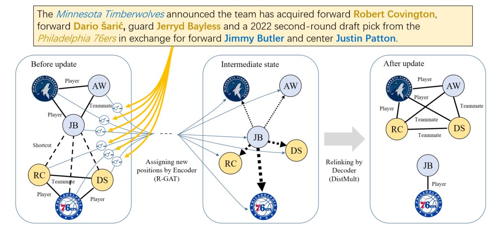

# GUpdater

### Overview

This repo contains the implementation of GUpdater, described in the EMNLP 2019 paper "Learning to Update Knowledge Graphs by Reading News". 

GUpdater leverages two key components, i.e. text-based attention and shortcuts, to control the message passing process through the KG structures, and therefore guide the KG updating.



Besides standard GUpdater, the ablated versions and the shortcut-labeled version, also can be easily tested by changing the settings in ``config/config.py``.

Note that to make the code clearer and more concise, we implement the shortcut-labeled GUpdater (GUpdater+label) in this repo slightly different from the paper's description. In this repo, we share model parameters for shortcut labeling and KG updating and train the two tasks jointly. While in the paper, we do these two tasks separately and sequentially, i.e., we first use a GUpdater encoder to train the shortcut labeling model, then use another GUpdater to train the KG updating model. 

### Dependencies

PyTorch >= 1.0.0

### Data

We provide the newly constructed dataset **NBAtransactions** in JSON format under ``data/``. The sizes of training set, validation set, testing set are 3262, 399, 438 respectively. Each data instance represents a NBA transaction and contains fields below:

* "event": Type of transactions, e.g., "trade", "free agency".
* "season": Corresponding NBA season.
* "text": The news text that report the transaction (already mapped to indices).
* "text_mentioned_entities": List of entities mentioned in the news text.
* "subgraph_before": The subgraph before the transaction happen. Note that this subgraph is generated by extracting the maximal connected subgraph given related team nodes, and may be different from the "1hop-subgraph".
* "subgraph_after": The subgraph after the transaction happen. Note that this subgraph is generated by extracting the maximal connected subgraph given related team nodes, and may be different from the "1hop-subgraph".

### Usage

1. Change the settings in ``config/config.py``.

2. Run ``exp/train.py`` for training.

   ```
   python3 exp/train.py
   ```

3. Run ``exp/test.py`` for model evaluation.

   ```
   python3 exp/test.py
   ```

   